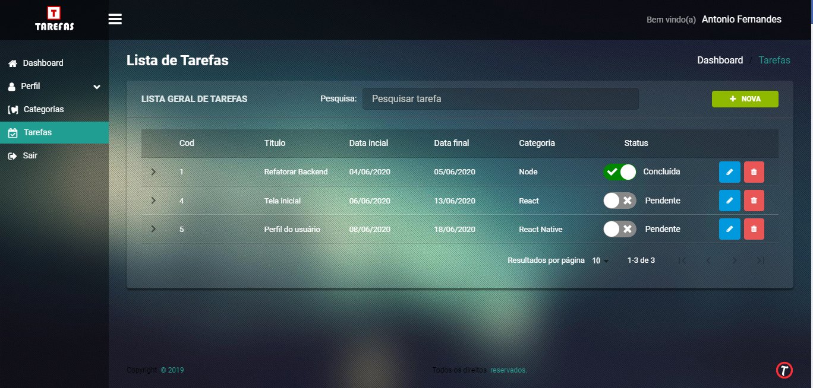

# Sistema de Gerenciamento de Tarefas

**Acesse a aplicação online [CLICANDO AQUI](https://happy-cori-9fe60b.netlify.app/)**




Implementação realizada por: **Antonio Joaquim Fernandes**
- Contato: **imbitubadigital@gmail.com**


## Requisitos da Aplicação:

 - Cadastro de Usuários
 - Login
 - Cadastro de Categorias
 - Cadastro de Tarefas por categoria


## Caso deseje instalar a aplicação

Execute o seguinte comando na raíz do projeto **front-end** para instalar dependências

```bash
yarn install
```


### Rodando o aplicação

Agora basta executar o seguinte comando:

```js
yarn start
```


### Backend da aplicaçao

Para instalar o backend da aplicação [clique aqui](https://github.com/imbitubadigital/backend-sistema-tarefas) e siga as instruções do mesmo.

